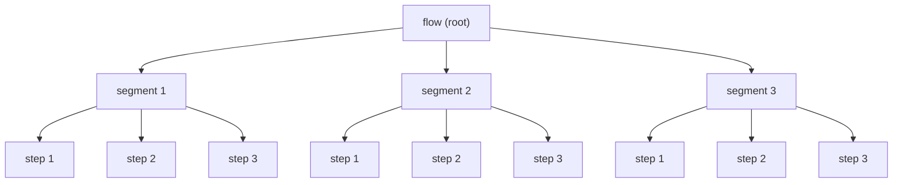

```python
import upnext

worker = upnext.Worker("my-worker")

@worker.task
async def fetch_data(source: str) -> dict:
    return {"source": source, "rows": 100}

@worker.task
async def transform(data: dict) -> dict:
    return {"transformed": True, **data}

@worker.task
async def pipeline(source: str) -> dict:
    raw = await fetch_data.wait(source=source)
    result = await transform.wait(data=raw.value)
    return result.value
```

Tasks can submit other tasks, creating **parent-child relationships** that form a workflow. UpNext automatically tracks the full execution tree — every child knows its parent and root — so you can trace, monitor, and debug multi-step pipelines from a single root job.

## How lineage works

When a task submits a child task, UpNext automatically sets:

- **`parent_id`** — the job ID of the task that submitted it
- **`root_id`** — the job ID of the top-level task that started the entire workflow

```python
@worker.task
async def parent_task():
    # child automatically gets parent_id=<this job> and root_id=<this job>
    result = await child_task.wait(x=1)

    # grandchild gets parent_id=<child job> and root_id=<this job>
    # (root stays the same through the entire tree)
    return result.value
```

No configuration needed — lineage is tracked through Python's `ContextVar`, so it works across any nesting depth.

## Failure propagation

When a child task fails, the exception bubbles up to the parent:

```python
from upnext import TaskExecutionError

@worker.task
async def orchestrator():
    try:
        result = await risky_child.wait(data="x")
        return result.value
    except TaskExecutionError as e:
        # Child failed — decide what to do
        return {"status": "degraded", "error": e.error}
```

Failure propagation is **explicit** — a child failure raises a `TaskExecutionError` in the parent, but doesn't automatically fail the parent. This gives you full control over recovery:

```python
@worker.task
async def resilient_pipeline():
    # Try primary source, fall back to secondary
    try:
        data = await fetch_primary.wait(query="data")
    except TaskExecutionError:
        data = await fetch_secondary.wait(query="data")

    return await process.wait(data=data.value)
```

## Fan-out / fan-in

Submit multiple child tasks in parallel and collect results:

```python
@worker.task
async def fan_out_example(user_ids: list[str]) -> list[dict]:
    # Fan-out: submit all in parallel
    results = await upnext.gather(
        process_user.wait(user_id=uid)
        for uid in user_ids
    )
    # Fan-in: collect all results
    return [r.value for r in results]
```

For large fan-outs, use `map_tasks` with concurrency control:

```python
@worker.task
async def batch_process(items: list[dict]) -> list:
    results = await upnext.map_tasks(
        process_item,
        [{"item": item} for item in items],
        concurrency=20,
    )
    return results
```

## Multi-level workflows

Workflows can nest to any depth. Each level automatically maintains the lineage chain:

```python
@worker.task
async def step(segment: int, step: int) -> dict:
    ctx = upnext.get_current_context()
    ctx.set_progress(100, f"Segment {segment}, step {step} done")
    return {"segment": segment, "step": step}

@worker.task
async def segment(segment: int, steps: int = 3) -> dict:
    ctx = upnext.get_current_context()
    completed = []

    for i in range(1, steps + 1):
        ctx.set_progress(i / steps * 100, f"Step {i}/{steps}")
        result = await step.wait(segment=segment, step=i)
        completed.append(result.value)

    return {"segment": segment, "steps": completed}

@worker.task
async def flow(segments: int = 3) -> dict:
    ctx = upnext.get_current_context()
    results = []

    for i in range(1, segments + 1):
        ctx.set_progress(i / segments * 100, f"Segment {i}/{segments}")
        result = await segment.wait(segment=i)
        results.append(result.value)

    return {"segments": results}
```

This creates a three-level execution tree:



Every job in the tree shares the same `root_id`, so you can query the entire workflow from the dashboard or API.

## Patterns

| Pattern | How | Use case |
| --- | --- | --- |
| **Sequential chain** | `await a.wait()` then `await b.wait()` | ETL pipelines, ordered steps |
| **Fan-out** | `gather(a.wait(), b.wait(), c.wait())` | Parallel data fetching |
| **Fan-out with limit** | `map_tasks(task, inputs, concurrency=N)` | Batch processing |
| **Race** | `first_completed(a.wait(), b.wait())` | Fastest provider wins |
| **Fire and forget** | `submit_many(task, inputs)` | Bulk enqueue, collect later |
| **Conditional** | try/except around `.wait()` | Fallback on failure |

<CardGroup cols={2}>
  <Card title="Parallel Execution" icon="layer-group" href="/guides/parallel-execution">
    Detailed guide on gather, map_tasks, first_completed, and submit_many.
  </Card>
  <Card title="Error Handling" icon="triangle-exclamation" href="/guides/error-handling">
    Configure retries and handle failures in workflows.
  </Card>
</CardGroup>
